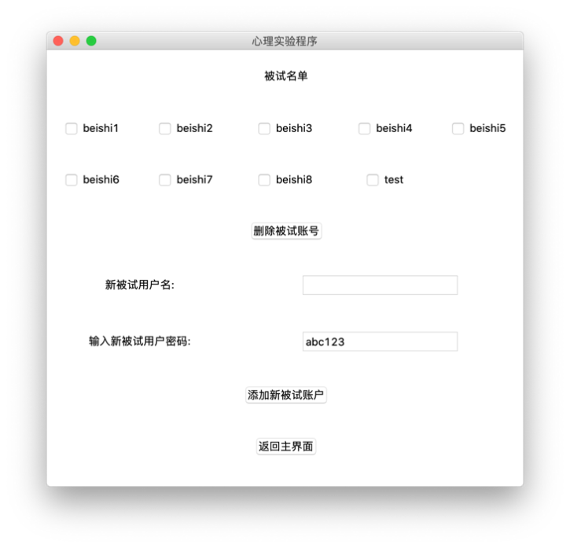

# 简单心理实验系统

# Simple manager for psychological experiments

*Autuor: Zizhuang Miao, Tianwei Zhang, & Zhaoxing Wang*

*06/14/2020*

## 软件使用说明
### 1  程序库结构

运行MainProgram.py后，程序开始运行。
系统初始化的用户信息如下表所示，其中有主试账户一个、被试账户八个，均可正常使用。此外，在Experiments文件夹中有一名为“新实验.py”的文件，可用于测试主试界面中添加实验、删除实验的功能。

### 2  主试

登陆之后，主试可进行的操作主要分为两类：对账户的操作和对实验的操作。通过点击下拉菜单栏中相应的选项，可进入账户信息的操作界面；通过点选主界面中的按钮，可进行相关的实验操作。

#### 登陆

用户需输入合法的用户名和密码，然后点击“登陆”。若用户名不存在或密码不正确，将出现弹窗提示用户重新输入。点击“退出程序”将关闭程序。

#### 主试主界面

主试窗口的左侧为现有所有实验的列表(下图所示的三个实验为程序自带的实验)，右侧的按钮用于对实验进行操作，菜单栏中的菜单用于对账户进行操作或退出程序。若在菜单栏中选择“返回/退出”，并在下拉菜单中选择“返回登陆界面”或“退出程序”，则将退出登陆或关闭程序。其余按钮以及菜单的使用方法介绍见后文。
 

#### 修改本账户信息

用户如果在菜单栏中选择“编辑账户信息”并在下拉菜单中选择“修改本账户信息”，则将进入如下界面。

用户须输入新用户名(该栏默认值为当前用户名，如不需修改用户名，可不输入)、当前密码、以及新密码。输入完成后点击“确认”则可更新本账户信息。新用户名不可与其他用户重名，新密码必须不少于6位，否则将出现弹窗提示用户重新输入。

#### 修改被试账户实验权限

用户如果在菜单栏中选择“编辑账户信息”并在下拉菜单中选择“修改被试账户实验权限”，则将进入如下界面，显示被试的实验权限。

若某被试无权限完成某实验，则该位置将显示为未勾选的“授权”；若有权限但仍未完成，则显示为已勾选的“授权”；若用户已完成实验，则显示为未勾选的“已完成，可再次授权”(用户仍可对其再次授权)。用户可通过勾选，对被试开放或关闭某一实验的权限。也可以通过点选“全部勾选”，对所有无权限的被试开放某一实验的权限(该操作对已完成该实验的用户无效，已完成实验的用户只能单独勾选)；点击后，该按钮将变为“取消全选”，再次点击后将取消全选。点击“保存信息”后将更新被试的实验权限。

#### 增加/删除被试账户

用户如果在菜单栏中选择“编辑账户信息”并在下拉菜单中选择“增加/删除被试账户”，则将进入如下界面。

用户可勾选希望删除的被试账户，并点击“删除被试账号”，完成删除。也可输入新的被试用户名和密码(密码默认为abc123)，并点击“添加新被试账户”，添加新的用户。新的用户名不得与已有用户名相同，被试密码不得少于6位，否则将会出现相应弹窗，提示用户重新输入。

#### 实验说明

用户若在主界面中选中实验，并点击“实验说明”，则将出现含有该实验说明的弹窗。实验说明中含有对实验的简单描述以及对实验参数的解释。
 

#### 设置参数

用户若在主界面中选中实验，并点击“设置参数”，则将出现修改实验参数的弹窗。其中库含实验说明和输入参数的输入栏。用户可根据提示，修改实验参数。
 

#### 添加实验

用户若在主界面中点击“添加实验”，则将出现弹窗。用户可输入新的实验名称，设置参数，并添加实验说明。

新添加的实验名称若为“x”，用户在添加新实验前需将名为“x.py”的文件加入文件夹Experiments中，否则添加将失败。“x.py”中应含有一个封装为类的tkinter窗口(用于进行实验)，且这个类应为程序中定义的所有类中的最后一个。实验参数最多有四个，实验程序中还应

在最后写入如下语句以使程序正常运行：
class_dict = {key: var for key, var in locals().items() if isinstance(var, type)}

#### 删除实验
用户若在主界面中选中实验，并点击“删除实验”，则将出现弹窗，向用户确认是否删除实验。只能删除自己添加的实验，程序自带的三个实验无法删除。

#### 运行实验
用户若在主界面中选中实验，并点击“运行实验”，则将运行选中实验，以测试实验是否能够正常运行。运行实验的结果将保存至实验对应的CSV文件中。

#### 查看参数
用户若在主界面中选中实验，并点击“查看参数”，则将出现含有实验说明以及当前设置的参数的弹窗。用户可通过阅读确认实验参数设置是否合理。

### 3  被试

相较于主试，被试能够进行的操作更少，只能修改自己账号的密码，或完成主试分配的实验。被试的登陆界面与主试相同，不再赘述。

#### 被试主界面

登陆后，被试的主界面左侧将显示被试尚未完成的实验，右侧将有“开始实验”以及“退出程序”的按钮，菜单栏中有“编辑账户信息”和“返回/退出”的选项。被试可选择相应按钮进行操作。除不能修改用户名外，菜单栏中按钮唤起的界面和功能与主试窗口相仿，此处不再重复。

#### 开始实验

用户若在主界面中选中实验，并点击“开始实验”，将打开实验窗口。完成实验后，实验结果将被写入对应的CSV文件，该实验也将从被试的实验列表中消去。

#### 示例实验——平均误差法测量差别阈限

该实验要求被试调整屏幕上出现的两个方块中其中一个的大小，开始前先呈现一段指导语，按回车键正式开始实验。某一个试次中的界面如下图所示。

被试可以按“↑”键使被调节刺激变大，按“↓”键使其变小。当感觉两个方块一样大之后，就按回车键确认，进入下一试次。所有试次结束后，实验窗口关闭。

#### 示例实验——阶梯法测量亮度绝对阈限

实验刚开始运行的界面如图17所示，为呈现给被试的指导语。单击鼠标后实验正式开始，呈现以下界面：

被试被要求判断能否看到画布中央的方块，如果能就按“F”键，不能就按“J”键。方块的亮度会根据被试的判断调整，详细调整规则见3.3.1。达到预先设置的转折点个数后，实验结束，按键盘上的任意键窗口就会关闭。

#### 示例实验——速度知觉实验

与上两个实验相同，实验开始前先给被试呈现一段指导语。正式开始后的每个试次里，屏幕上下侧或左右侧会分别出现一个黑色矩形，表示起点和终点，并在起点一侧紧贴矩形出现一个红色小正方形，以一定速度向终点垂直匀速直线运动，如下图所示。

小方块运行到途中某一点时会消失，此后它仍然以原速度运动，被试要在自己认为方块抵达另一边的时刻按回车键反应。之后，屏幕上出现被试的判断和小方块实际抵达终点的时刻的差值，如图20下图所示，正值表示判断晚了，负值表示判断早了，停留1.5秒后进入下一试次。所有试次结束后，窗口关闭。